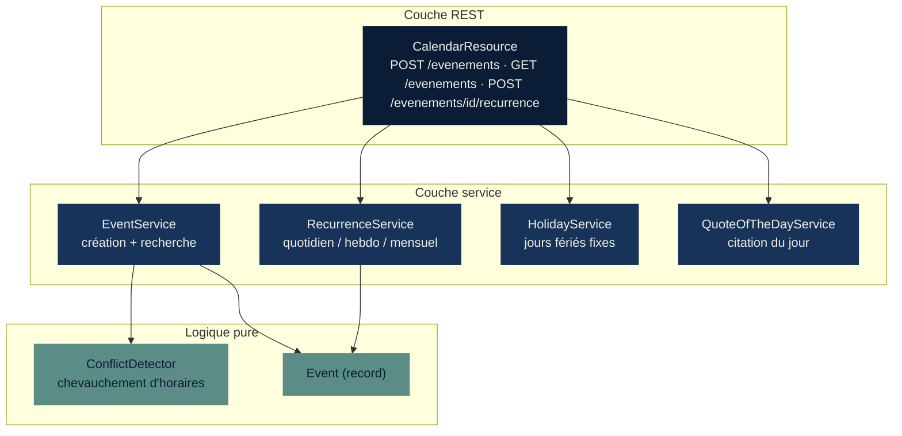
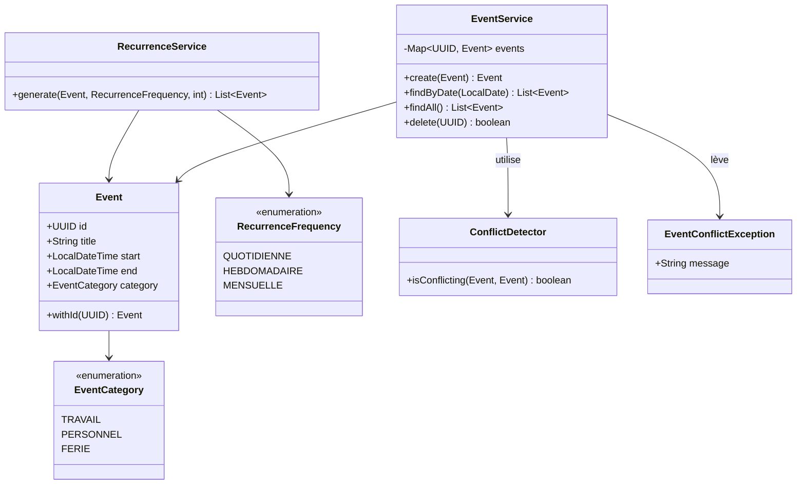
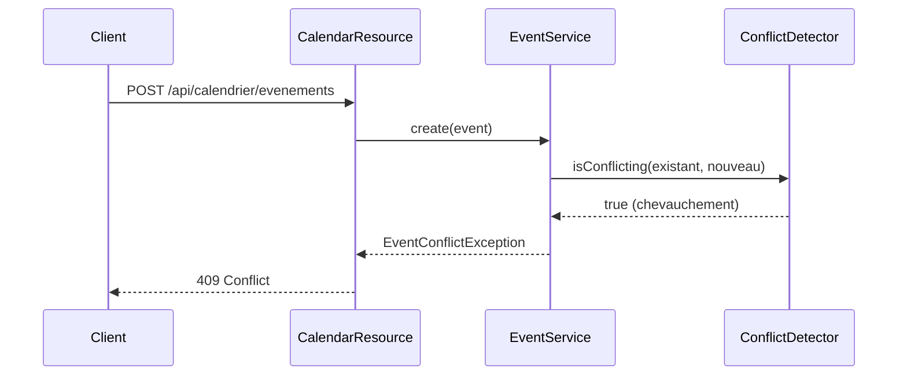
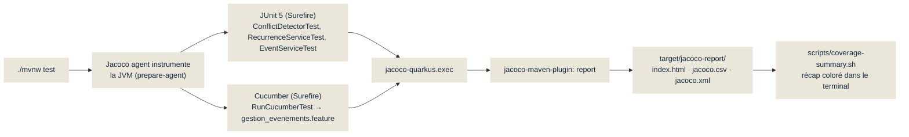

# couverture-code — Description du projet

## Objectif

Support de démonstration pour une conférence sur les tests des applications
Java. La stack **Quarkus + JUnit + Cucumber + Jacoco** est illustrée par un
projet volontairement simple — un agenda d'événements — afin de montrer,
lors d'un build (`./mvnw test`), un **rapport de couverture de code** qui met
en évidence quelles classes (et quelles branches) ont besoin d'être mieux
testées.

Ce n'est pas un produit : c'est un terrain d'exemple. La logique métier
contient volontairement des branches et des chemins de code non couverts,
pour donner à la conférence un exemple concret et mesuré (pas inventé) de
« trou de couverture ».

## Le projet de démo : un agenda malin

Une API REST Quarkus qui permet de :

- créer un événement et **refuser automatiquement** ceux qui chevauchent un
  événement déjà planifié (`ConflictDetector`) ;
- consulter les événements d'une journée, avec en bonus le signalement d'un
  **jour férié** (`HolidayService`) et une **citation du jour** sur les
  tests (`QuoteOfTheDayService`) ;
- générer des **occurrences récurrentes** d'un événement (quotidien,
  hebdomadaire, mensuel) via `RecurrenceService`.

Aucune base de données : le stockage est un simple `ConcurrentHashMap` en
mémoire (`EventService`). Le sujet du jour est la couverture de tests, pas la
persistance.

## Architecture



## Modèle de domaine



## Scénario clé : refus d'un événement en conflit



Ce même scénario existe sous deux formes dans le projet : un test **JUnit**
unitaire sur `ConflictDetector` (logique pure, aucune dépendance), et un
scénario **Cucumber** de bout en bout qui passe par l'API REST — les deux
répondent à des questions différentes (« la fonction est-elle correcte ? »
contre « le comportement observable est-il le bon ? »).

## De `mvn test` au rapport de couverture



## Ce que le rapport montre (mesures réelles)

Résultat d'un run `./mvnw test` (17 tests, 0 échec) — couverture de lignes
par classe, extraite de `target/jacoco-report/jacoco.csv` :

| Classe | Couverture lignes | Ce que ça révèle |
|---|---|---|
| `RecurrenceRequest` (DTO) | 0 % | Un simple `record` jamais exercé directement — cas limite trivial à corriger. |
| `CalendarResource` | 58 % | La méthode `createRecurrence` n'est appelée par **aucun** test (ni JUnit, ni Cucumber). |
| `Event` (modèle) | 67 % | `withId(...)` n'est jamais testé isolément. |
| `RecurrenceService` | 78 % | La branche `MENSUELLE` du `switch` n'est pas couverte — c'est justement le cas le plus intéressant (fin de mois, année bissextile). |
| `EventService` | 88 % | Bien couvert, quelques branches secondaires manquantes. |
| `HolidayService` | 93 % | Couverte **par ricochet** via le scénario « jour férié », pas par un test dédié — `isHoliday()` seule n'est jamais appelée directement. |
| `QuoteOfTheDayService` | 100 % | Couverte elle aussi par ricochet — bon exemple pour rappeler que « couvert » ne veut pas dire « testé exprès ». |

Ces écarts ne sont pas fabriqués : ce sont les résultats obtenus après avoir
écrit des tests JUnit et Cucumber « normaux », sans chercher à tout couvrir.
C'est exactement le point de la conférence — le rapport de couverture révèle
des trous qu'une suite de tests « verte » ne montre pas.

## Comment lancer la démo

```bash
./mvnw test                          # build + tests + rapport Jacoco
./scripts/coverage-summary.sh        # récap coloré dans le terminal
open target/jacoco-report/index.html # rapport détaillé, ligne par ligne
```

## Documentation associée

- [`CLAUDE.md`](./CLAUDE.md) — conventions et instructions du projet.
- [`PROMPT.md`](./PROMPT.md) — journal des prompts utilisés pour construire
  ce projet.
- [`presentation/couverture-code-conference.pptx`](./presentation/couverture-code-conference.pptx) —
  support de la conférence (10 slides, palette bleu marine / tons doux).
