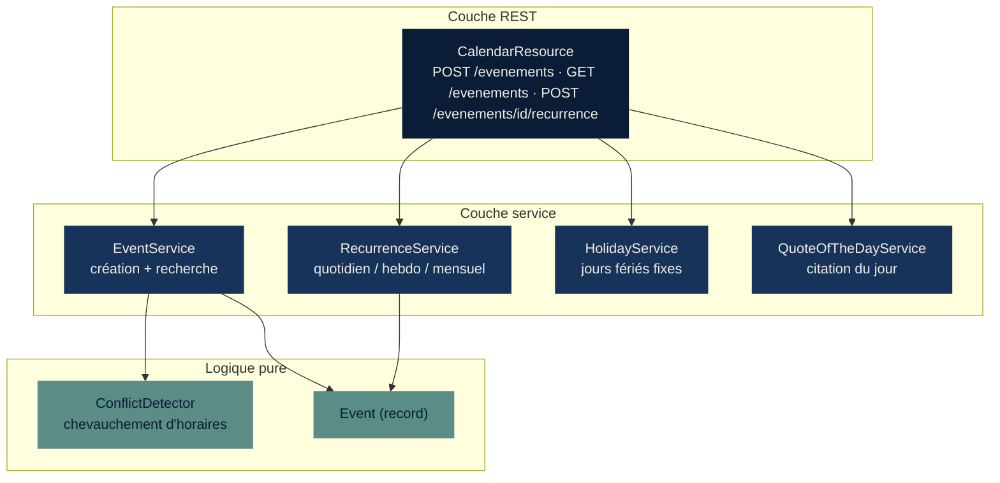
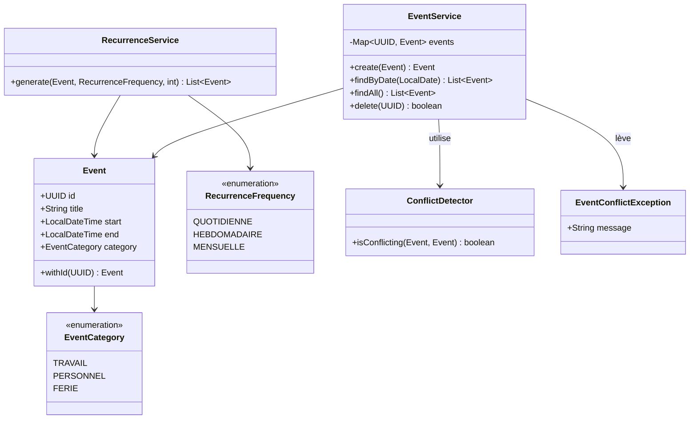
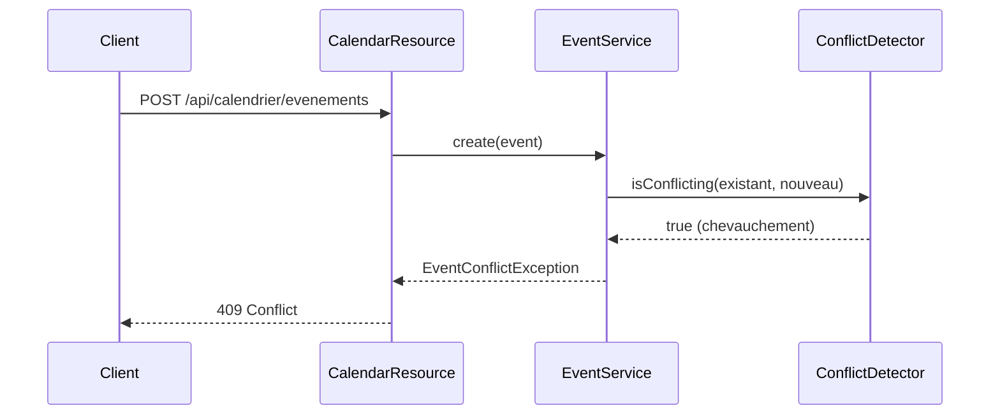
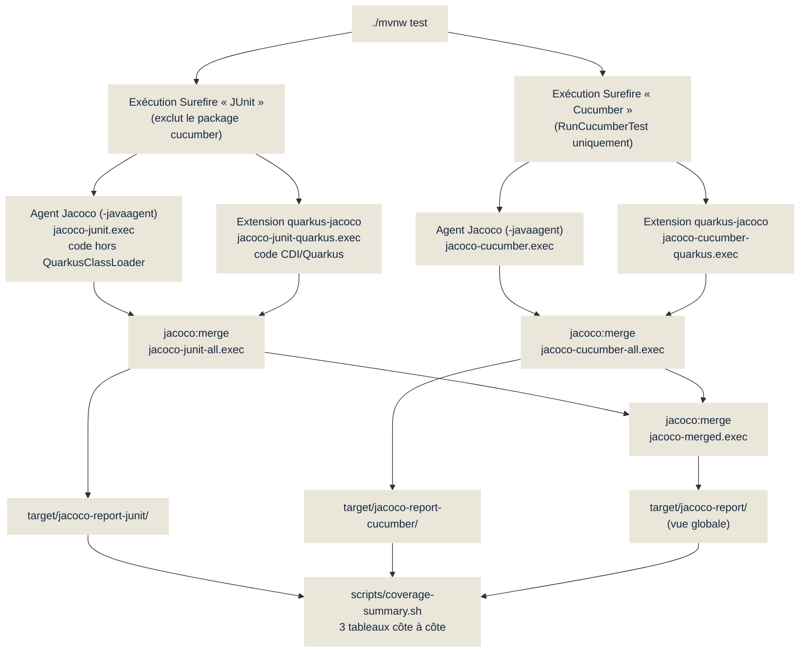

# couverture-code — Description du projet

## Objectif

Support de démonstration pour une conférence sur les tests des applications
Java. La stack **Quarkus + JUnit + Cucumber + Jacoco** est illustrée par un
projet volontairement simple — un agenda d'événements — afin de montrer,
lors d'un build (`./mvnw test`), un **rapport de couverture de code** qui met
en évidence quelles classes (et quelles branches) ont besoin d'être mieux
testées.

Ce n'est pas un produit : c'est un terrain d'exemple. La logique métier
contient volontairement des branches et des chemins de code non couverts,
pour donner à la conférence un exemple concret et mesuré (pas inventé) de
« trou de couverture ».

## Le projet de démo : un agenda malin

Une API REST Quarkus qui permet de :

- créer un événement et **refuser automatiquement** ceux qui chevauchent un
  événement déjà planifié (`ConflictDetector`) ;
- consulter les événements d'une journée, avec en bonus le signalement d'un
  **jour férié** (`HolidayService`) et une **citation du jour** sur les
  tests (`QuoteOfTheDayService`) ;
- générer des **occurrences récurrentes** d'un événement (quotidien,
  hebdomadaire, mensuel) via `RecurrenceService`.

Aucune base de données : le stockage est un simple `ConcurrentHashMap` en
mémoire (`EventService`). Le sujet du jour est la couverture de tests, pas la
persistance.

## Architecture



## Modèle de domaine



## Scénario clé : refus d'un événement en conflit



Ce même scénario existe sous deux formes dans le projet : un test **JUnit**
unitaire sur `ConflictDetector` (logique pure, aucune dépendance), et un
scénario **Cucumber** de bout en bout qui passe par l'API REST — les deux
répondent à des questions différentes (« la fonction est-elle correcte ? »
contre « le comportement observable est-il le bon ? »).

## De `mvn test` au rapport de couverture — scindé par type de test

`./mvnw test` lance **deux exécutions Surefire distinctes** (une pour les
classes JUnit, une pour `RunCucumberTest`), chacune avec son propre agent
Jacoco. Une subtilité à connaître : le code qui tourne à travers CDI/Quarkus
(un bean injecté dans un `@QuarkusTest`, ou tout l'aller-retour REST d'un
scénario Cucumber) est mesuré **séparément** par l'extension
`quarkus-jacoco`, pas par l'agent `-javaagent` du `jacoco-maven-plugin` — les
deux sources doivent donc être fusionnées avant de générer un rapport
exploitable pour chaque type de test.



## Ce que le rapport montre (mesures réelles)

Résultat d'un run `./mvnw test` (17 tests, 0 échec) — couverture de lignes
par classe, JUnit seul contre Cucumber seul contre la vue globale :

| Classe | JUnit seul | Cucumber seul | Global | Ce que ça révèle |
|---|---|---|---|---|
| `CalendarResource` | **0 %** | 58 % | 58 % | La couche REST n'est testée que par Cucumber — JUnit ne l'appelle jamais. |
| `HolidayService` | **0 %** | 93 % | 93 % | Idem : couverte uniquement par le scénario « jour férié », par ricochet. |
| `RecurrenceService` | 78 % | **4 %** | 78 % | À l'inverse : la logique de récurrence est testée par JUnit, presque pas par Cucumber (aucun scénario n'appelle l'endpoint de récurrence). |
| `ConflictDetector` | 100 % | 75 % | 100 % | Les deux la couvrent, mais pas les mêmes branches — l'union comble les trous. |
| `EventService` | 88 % | 88 % | 88 % | Bien couverte par les deux indépendamment : un vrai signal de confiance. |
| `RecurrenceRequest` (DTO) | **0 %** | **0 %** | 0 % | Angle mort partagé : ni JUnit ni Cucumber ne l'exercent. Le seul cas où la vue globale n'aide pas. |

Le constat clé pour la conférence : **JUnit et Cucumber ne couvrent presque
pas les mêmes lignes**. JUnit valide la logique métier en isolation ; Cucumber
valide le comportement observable via l'API. Une vue de couverture qui ne
distingue pas les deux masque cette complémentarité — et masque aussi les
angles morts que les deux partagent (`RecurrenceRequest`).

Ces écarts ne sont pas fabriqués : ce sont les résultats obtenus après avoir
écrit des tests JUnit et Cucumber « normaux », sans chercher à tout couvrir.
C'est exactement le point de la conférence — le rapport de couverture révèle
des trous qu'une suite de tests « verte » ne montre pas.

## Comment lancer la démo

```bash
./mvnw test                                   # build + tests + 3 rapports Jacoco
./scripts/coverage-summary.sh                 # JUnit / Cucumber / global, côte à côte

open target/jacoco-report-junit/index.html    # couverture JUnit seule
open target/jacoco-report-cucumber/index.html # couverture Cucumber seule
open target/jacoco-report/index.html          # vue globale (union des deux)
```

## Documentation associée

- [`CLAUDE.md`](./CLAUDE.md) — conventions et instructions du projet.
- [`PROMPT.md`](./PROMPT.md) — journal des prompts utilisés pour construire
  ce projet.
- [`presentation/couverture-code-conference.pptx`](./presentation/couverture-code-conference.pptx) —
  support de la conférence (10 slides, palette bleu marine / tons doux).
