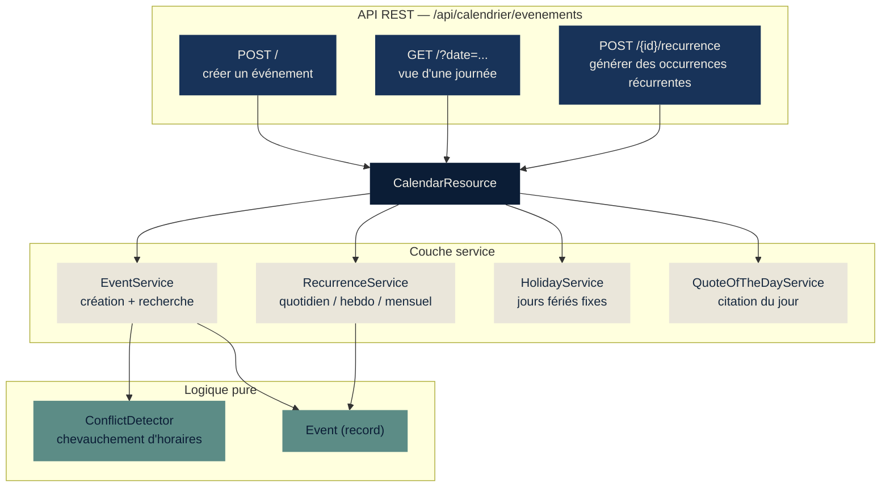
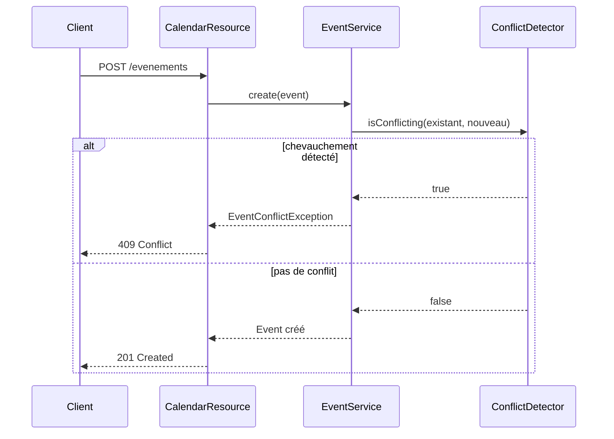
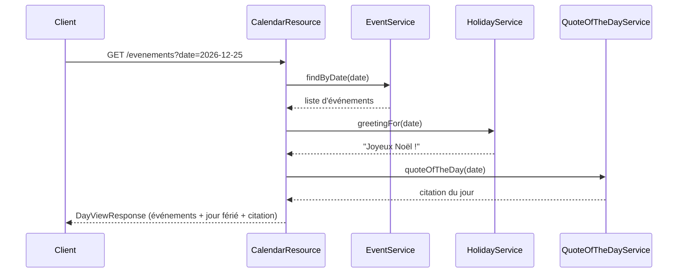
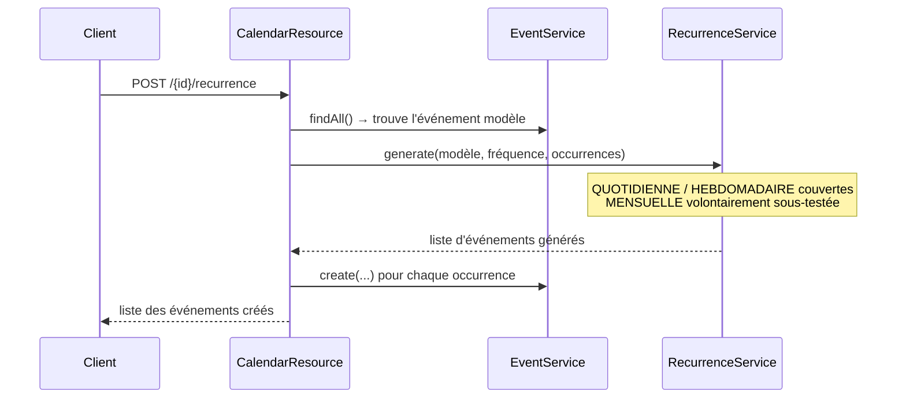
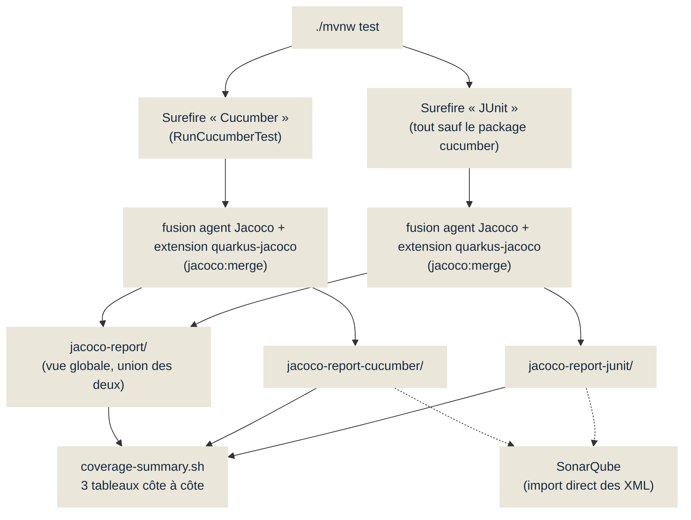

# couverture-code

Support technique d'une conférence sur les tests des applications Java :
un mini agenda d'événements sert de terrain d'exemple pour montrer, lors
d'un build, **un rapport de couverture de code qui révèle quelles classes
ont besoin d'être mieux testées**.

> Ce n'est pas un produit. La logique métier contient volontairement des
> trous de couverture, mesurés et non inventés — voir
> [Convention : les classes volontairement sous-testées](#convention-les-classes-volontairement-sous-testées).

## Démarrage rapide

```bash
./mvnw test                                                # build + tests
./scripts/coverage-summary.sh                               # récap couleur dans le terminal

open quarkus-app/target/jacoco-report-junit/index.html      # couverture JUnit seule
open quarkus-app/target/jacoco-report-cucumber/index.html   # couverture Cucumber seule
open quarkus-app/target/jacoco-report/index.html            # vue globale (union des deux)
```

## Structure du dépôt

`pom.xml` racine en simple agrégateur (`packaging=pom`) avec un seul module,
`quarkus-app` : Quarkus 3.39.2 + JUnit 5 + Cucumber (FR) + Jacoco (rapport
scindé JUnit/Cucumber/global) + SonarQube en bonus.

`./mvnw test` depuis la racine construit et teste le module ; `./mvnw -pl
quarkus-app test` fait la même chose explicitement.

## Comment fonctionne l'application

Un agenda en mémoire (aucune base de données, `ConcurrentHashMap` dans
`EventService`) exposé par une API REST :



### Créer un événement : détection de conflit



Ce scénario existe sous deux formes dans le projet : un test **JUnit**
unitaire sur `ConflictDetector` (logique pure, sans dépendance), et un
scénario **Cucumber** de bout en bout qui passe par l'API REST — deux
questions différentes (« la fonction est-elle correcte ? » contre « le
comportement observable est-il le bon ? »).

### Consulter une journée : agrégation de trois sources



### Générer des occurrences récurrentes — l'endpoint volontairement non testé



`CalendarResource.createRecurrence` est l'exemple choisi pour la conférence :
une fonctionnalité livrée mais jamais vérifiée bout-en-bout par aucun test
(ni JUnit, ni Cucumber) — voir plus bas.

## De `mvn test` au rapport de couverture



Diagramme détaillé (avec les fichiers `.exec` intermédiaires) et explication
de la subtilité `quarkus.jacoco.data-file` dans
[`DESCRIPTION.md`](./DESCRIPTION.md#de-mvn-test-au-rapport-de-couverture--scindé-par-type-de-test).

Le constat clé : **JUnit et Cucumber ne couvrent presque pas les mêmes
lignes** — JUnit valide la logique métier en isolation, Cucumber valide le
comportement observable via l'API. Voir le tableau de mesures réelles dans
`DESCRIPTION.md`.

## Convention : les classes volontairement sous-testées

`CalendarResource.createRecurrence`, la branche `MENSUELLE` de
`RecurrenceService`, et le DTO `RecurrenceRequest` sont **intentionnellement**
moins couverts, pour servir d'exemple concret pendant la conférence. Ne pas
"corriger" ces trous sans consulter l'utilisateur — ils font partie du script
de la démo.

## Documentation associée

- [`DESCRIPTION.md`](./DESCRIPTION.md) — description complète du projet,
  modèle de domaine, mesures de couverture réelles, bonus SonarQube.
- [`CLAUDE.md`](./CLAUDE.md) — conventions et instructions du projet.
- [`SCRIPT.md`](./SCRIPT.md) — script de présentation (minutage, texte, cues
  de démo en direct), ton volontairement comique.
- [`presentation/`](./presentation/) — support de la conférence (pptx +
  scripts de génération).
- [`sonarqube/docker-compose.yml`](./sonarqube/docker-compose.yml) —
  SonarQube Community local pour la démo bonus.
